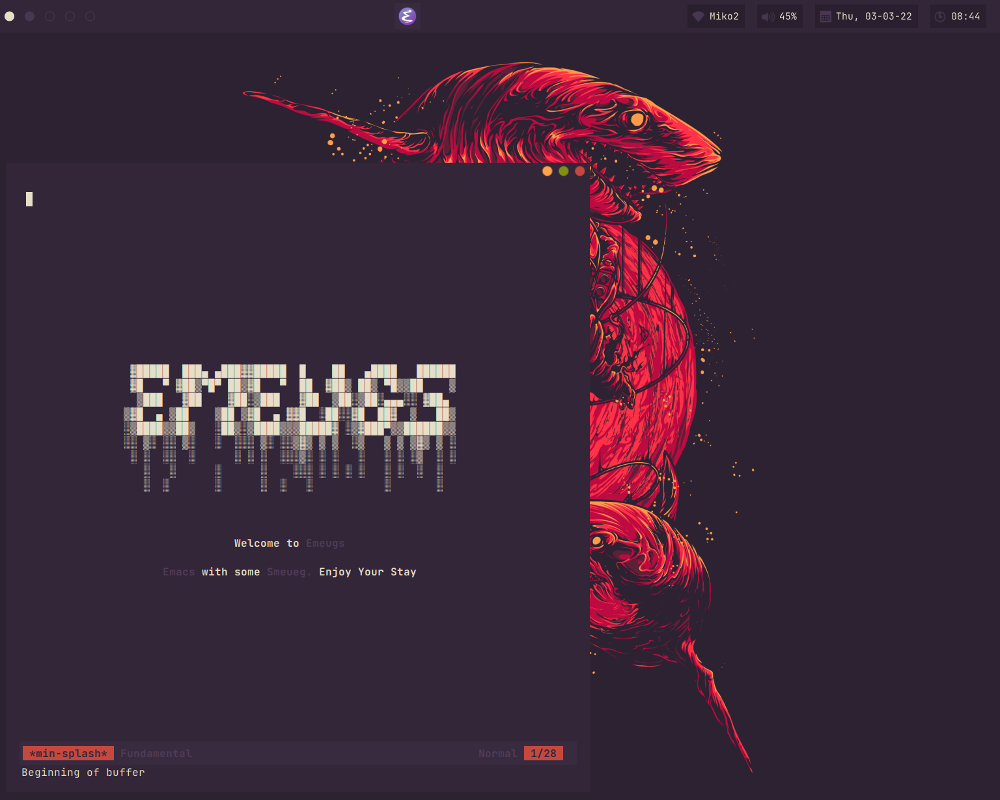

<div align="center">

<h1>Very Smeueg Dotfiles For Linux</h1>

</div>


## TODO
- Add a license
- Clean up the system
- Add screenshots
- Create a gitlab.io page


## Programs
### Things I use:
- AwesomeWM
- Emacs
- Bash
- Pixelorama (for the pfp and WIP wallpaper)

### Things I used to use (Configurations still exists but I don't edit and use them anymore):
- Neovim (0.5+)
- Vim
- Tmux

I no longer use any suckless utilites and as such, my forks of those are now
deleted. When I do try it out again, I will use:
- [dwm-flexipatch](https://github.com/bakkeby/dwm-flexipatch)
- [st-flexipatch](https://github.com/bakkeby/st-flexipatch)
- [dmenu-flexipatch](https://github.com/bakkeby/dmenu-flexipatch)
- [slock-flexipatch](https://github.com/bakkeby/slock-flexipatch)


## "Dependencies"
### Mandatory
- Emacs
- Awesomewm
- A shell (A posix compliant one, *NOT* fish)

### Optional
These are all really optional, since without them, the "rice" would still be functional:
- xset (Change autorepeat value)
- xrandr (To change the resolution)
- xrdb (To set xresources values)


## Installing/Migrating into a new system
There are multiple ways to become more smeueg **INSTANTLY**:
```sh
# Either run
sh <<EOF
$(curl -L https://gitlab.com/Smeueg/dotfiles/-/raw/master/.config/scripts/migrate/smeueger)
EOF
# Or
sh <(curl -L https://gitlab.com/Smeueg/dotfiles/-/raw/master/.config/scripts/migrate/smeueger)
# Or
sh <<< "$(curl -L https://gitlab.com/Smeueg/dotfiles/-/raw/master/.config/scripts/migrate/smeueger)"
```
This _should_ be able to work with most shells that are *sort of* posix
compliant (except for fish).
Note: This is a *POST*-Install script so this **WILL NOT** install any
dependencies automatically.

## Using a git bare repository to manage your salty dotfiles
Refer to the arch wiki: https://wiki.archlinux.org/index.php/Dotfiles


## Recommendations (from myself)
1. Mount /tmp as tmpfs or zram. This reduces reads and writes to the HDD/SSD. (Keep in mind that on each reboot everything in /tmp will be deleted, if it hasn't already)
2. Also read about [zram](https://www.kernel.org/doc/html/latest/admin-guide/blockdev/zram.html)/zswap/zcache which will also reduce reads and writes to the HDD/SSD
3. For people that use github or gitlab, install [hub](https://github.com/profclems/glab) or [cli/gh](https://github.com/cli/cli), both of which are for github, or [lab](https://github.com/zaquestion/lab/) or [glab](https://github.com/profclems/glab) and both are for gitlab
4. If you want a bitmap font, [scientifica](https://github.com/NerdyPepper/scientifica) and [cozette](https://github.com/slavfox/Cozette) seems interesting
5. Try out the ultimate recipe which I call the BBBCCCCDHHJPST sandwhich or the 3B4CDHHJPST sandwhich (bacon beef beans chicken chili cheese chili flakes duck ham hot sauce jalapenos pork sausage turkey sandwich)

### Distro Specific:
#### Alpine:
Do not forget to install elogind, linux-firmware and add your normal user to the
video and input group

### Dual Booting Windows:
Don't... Windows is garbage

If you still are going to:
Either change linux to use localtime instead of UTC *or* change Windows to use
utc instead of localtime. [This Link](https://itsfoss.com/wrong-time-dual-boot/) (beware of the blinding light)
